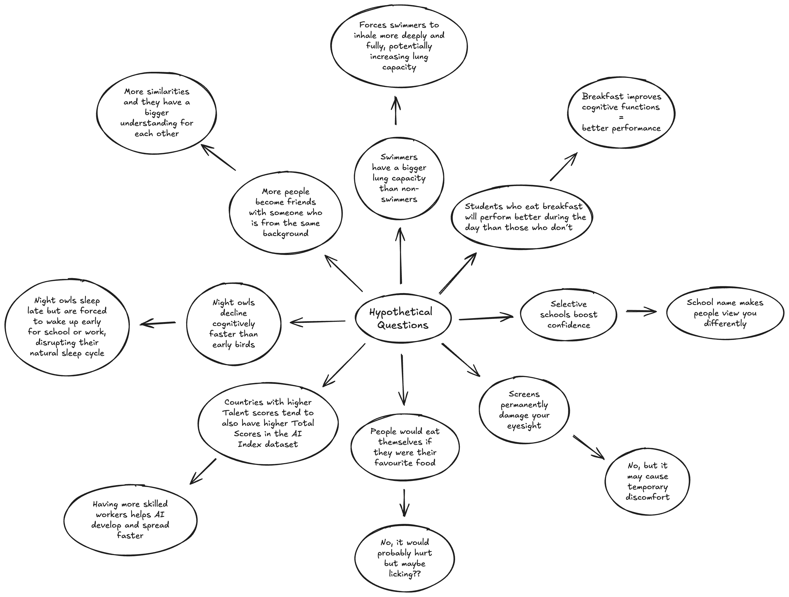

# Assessment-Task-3
## Requirements Outline  

### Mind Map:

-----

### Chosen Issue:
Countries with higher Talent scores tend to also have higher Total Scores in the AI Index dataset.  
https://www.kaggle.com/datasets/katerynameleshenko/ai-index 

-----

### Discuss the Findings:
Talent measures the number of skilled AI professionals in the country which is essential for driving research, development and the implementation of AI. The total score combines talent with other factors such as infrastructure, research output and government strategy to give an overall assessment. For example, the United States has a high Talent score and also a high Total Score, whereas countries with lower Talent scores generally have lower Total Scores. This pattern suggests a relationship between the number of skilled AI professionals and overall AI performance. It is similar to a sports team, where having more skilled players can contribute to better performance, though other factors also influence the outcome. 

-----

### Functional Requirements :   
__Data Loading__:
In my code, the system must be able to load data from the CSV file. It must check that then file is in correct format before loading. If there is no option for the input the user provided, it should show an error message.

__Data Cleaning__:
The data won’t have any missing values as it will be from kaggle. Additionally, it should allow a filtering system, country by country, and produce the talent and total score for the country asked. 

__Data Analysis__:
The code should show the correlation between talent and total score for all countries to back up my statement. 

__Data Visualisation__:
The data will need to be visualised in a group bar chart with clear labels and titles. The country name should beon the x-axis and the scores on the y-axis. The talent and total score will be different colours and be grouped together. It will be named ‘Talent vs Total Score by Country’.

__Data Reporting__:
The output should include a group bar chart visualisation of the whole dataset, a display of the whole dataset depending on how many rows they want and the talent and total score for just the country they input.

-----

### Non-Functional Requirements :  
Usability:  
The User Interface should show the 4 options which the user is allowed to choose from and view. For data filtering, it should the produce an area for the user to input their chosen country while the view dataset option should produce an area for the user to input their chosen number of rows. The README document on the other hand show show the user on how to use the User Interface, like explaining what options they have to choose from or what happens if they input something he code can’t recognise or process. It should also explain the main idea of the User Interface.

Reliability:  
The system should inform the users on where they went wrong and provide them an area to input correctly. This includes producing an error message or outputting the default option. It should also always showcase the correct information and never get any countries mixed up.

-----

### Use Case :
__Actor__: User

__Goal__: To access and interact with existing data through the program’s user interface.

__Preconditions__:
The dataset has already been preloaded into the system.
The user has access to the system interface.

__Main Flow__:  
1. User opens the program and is presented with a text-based menu.  
2. User selects one of the following options:
    * View data (To view the dataset) 
    * View visualisation (To view the group bar chart of the dataset)
    * Search or filter data (Based on country name)
    * Exit (To exit the User Interface). 
3. System performs the requested action and outputs to user.

__Postconditions__:  
* User has viewed the data in different forms
The dataset
* The group bar chart
* The information for a specific country

-----

### Data Dictionary
| Field | Datatype | Format for display | Description | Example | Validation |
|----------|----------|----------| -------- | -------- | -------- |
| Country  | object | XX...XX | Name of the country | Australia | Can be any amount of characters but must not include numbers. |
| Talent  | float64 | NNN.NN | How many skilled people are available to work | 25.43 | Must be a decimal number to 2 decimal places. |
| Total Score | float64 | NNN.NN | How advanced the country is in terms of AI | 33.86 | Must be a decimal number to 2 decimal places. |

-----

### Analyse and Conclude
Countries with higher talent tend to have higher total scores in the AI index. This is because talent, which measures the number of skilled AI workers in a country, is a major factor contributing to the overall score. The more skilled workers a country has, can help with the growth and research as they have more brainpower, creativity and expertise. For example, the United States has the top scores in both Talent and Total Score, suggesting that they are linked. It’s like preparing for a relay race - a team with more skilled runners is more likely to have a better chance at winning than those teams with less skilled runners. Having a larger amount of talented runners will give the team a significant advantage in winning the race.

-----

### Peer Evaluation:
__Plus:__
* The data viewing is very fancy and you can choose the amount of rows you want to see (easier and more useful for users)
* There is invalid input error message 
* Visualisation is very detailed and easy to understand

__Minus:__
* Maybe there can be spaces between the options and answers to increase clarity and readability for users
* Some of the error message could maybe be more clear and say why the error happened

__Implication:__  
Overall the user interface is extremely detailed and well-thought over with a lot of options to pick to optimise data analysis, but some changes should be made to improve the overall user experience and increase clarity and structure in the program.

-----

### Evaluation your Project:
__Evaluate your system and results in relation to your Requirements Outline:__  
My system successfully meets my function, non-functional and use case requirement outlines. 
For dataloading, it correctly loads the dataset CSV file and produces appropriate error messages from invalid user inputs. In data cleaning, my code filters by country and displays the talent and total score for the selected country. For data analysis, it shows the relation between the two scores across all countries. In data visualisation, the systems generates a group bar chart with clearly labeled axes, titles and colour-coded bars for each country. For data reporting, the program outputs the requested dataset rows, specific scores for each country and the correct visualisation. 
In usability, the user interface provides a clear menu options for users to choose from and the README explains how to use these features and what happens with an invalid input. Regarding reliability, it gives the error message when needed and prevents errors such as mixing up country information. 

__Evaluate your system in relation to peer feedback:__  
In relation to my peer feedback, some areas for improvement included making space in between the options and answers to increase clarity and readability for some users. It also states that I could also clearly show the user why an error happened after an invalid input so that they could correct it more easily. On the other hand, some positive feedback included that the visualisation was clear and understandable, that there was an invalid input error message and that I had made it so that the viewer could choose the number of rows they wanted to see when viewing the dataset. Overall, I could have made my user interface more aesthetic and pleasing to the eye.

__Evaluate your project in relation to project management:__  
When I first started and had to work on my researching and planning, I had difficulty finding a dataset and information on my very first hypothesis. Due to this I changed my statement a few times until I decided to find a dataset first and then create my question. Additionally, I didn’t know how I was going to do my code so I couldn’t clearly start on my requirement outlines. I had to do them at home while I was working on my code at school. I also did not realise we had to create a README file so I did that on a Tuesday night after receiving my peer feedback which I worked on on Wednesday. I feel like I could have managed my time skills a bit better overall so that I wouldn’t have had to cram everything in before the thursday to check over my code once more. 

__Evaluate your system in in relation to its data and security:__  
My data from kaggle is valid, accurate and up-to-date, ensuring that my analysis reflects accurate information. The data is unbiased and showcases scores with favouring any particular country. In terms of security, my data does not collect any sensitive data from the user since it was off a CSV file. Regarding the UX, the user interface is clear and functional but could be improved with more spacing, clearer instructions, and descriptive error messages.