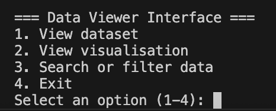
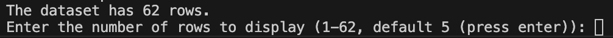
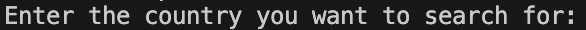

# User Guide
## The User Interface

The user interface has 4 options in total. You choose an option by inputing a number from 1 to 4.

If you put in an invalid number, the error message will be:
* "Invalid selection. Please choose a number between 1 and 4."

### Option 1 : View dataset
If you input the number 1, the terminal will produce these lines:

This tells you that the dataset provided has 62 rows in total. From here input a number from 1 to 62. If you input a number smaller than 1 or bigger than 62, the terminal will show the default setting which is the first 5 lines of the dataset. 

If you put in an invalid number, the error messages provided will be:  
* "Number out of range. Showing first 5 rows instead."
* "Invalid input. Showing first 5 rows instead."

### Option 2 : View visualisation
If you input the number 2, the screen will immediately pop up with a group bar chart visualiation of the dataset.

Just press the red button on the top left corner to exit.

### Option 3 : Search or filter data
If you input the number 3, the terminal will produce another line.

From here, you enter the name of any country. For example, 'United States of America' or 'Australia". It will then produce the talent and total score of your chosen country.  

However, if you enter a country that is not on the dataset, an error message will pop up.  
* "No data found for (country name)"

### Option 4 : Exit
If you input the number 4, the terminal will exit you out of the User Interface.

It will say:
* "Exiting program."